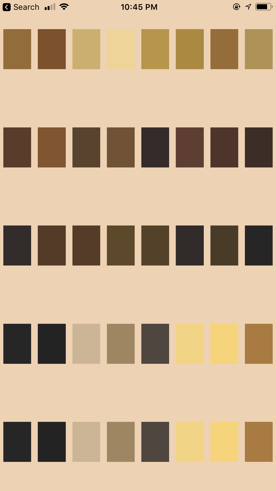

##REACT NATIVE ALIGN ITEMS

This project was bootstrapped with [Create React Native App](https://github.com/react-community/create-react-native-app).

## Installation

```bash
npm i react-native-flex-helper
```

#Beta versions

version 0.1.0 in npm.

##Usage

Import the package and add a few properties to it. The main idea is to pass all the element you want to
form into an array and set how many elements you want to display in a row by property 'numberInRow'.

For now, the only elements you can pass to the item array is hex color string. Hope I can make it more flexible soon.

```javascript
import React, { Component } from 'react';
import AlignItems from './src/components/Alignitems.js';

class Example extends Component {
  constructor(props){
    super(props);
    this.state = {
      colors:['#996b32', '#834f27', '#d0ae66', '#f3d390', '#bd933a','#b08931','#9c6b2f','#b3914e','#5e3b28', '#875329','#5c422b',
      '#765133','#372b2a','#643c30','#513429','#3f2d25','#342c2a','#573a25','#583b25','#604725', '#584026','#322b29',
      '#4b3c27','#282627','#282626','#252324','#d1b492','#a3855e','#50463e','#f7d279','#fbd26b', '#b07938','#b07d32',
      '#864529', '#6a2c25','#e18a37','#e3b754','#c85e29','#723425','#3f2c26','#f4dc36','#fcca35','#8d6329','#896a2d'],
    };
  }

  render() {
    const numberInRow = 5,
          totalDisplayItems = 20,
          widthRatioFromParent = '60%',
          heightRatioFromParent = '60%';
          styleForSingleElement = [{width:40,height:40,borderRadius:40,alignSelf:'center',margin:5}];
    return (
      <View>
        <AlignItems numberInARow = {numberInRow}
                    totalDisplayItems = {totalDisplayItems}
                    items = {this.state.colors}
                    widthRatioFromParent = {widthRatioFromParent}
                    heightRatioFromParent = {heightRatioFromParent}
                    elementStyle = {styleForSingleElement}
                    >
        </AlignItems>
      </View>
    );
  }
}
```


```javascript
const numberInRow = 8,
      totalDisplayItems = 32,
      widthRatioFromParent = '100%',
      heightRatioFromParent = '100%';
      styleForSingleElement = [{flex:1, width:60,height:60,borderRadius:0,alignSelf:'center',margin:5}];
``` 

 

You can modify the numberInRow, to change the number in a single row, change the ratio of width/height to the 
parent, change the style of how you want to display it by passing array of css property.

```javascript
const numberInRow = 8,
      totalDisplayItems = 32,
      widthRatioFromParent = '100%',
      heightRatioFromParent = '100%';
      styleForSingleElement = [{flex:1, width:60,height:60,borderRadius:0,alignSelf:'center',margin:5}];
```
 

## Properties
 name                   | description                                   | type       | default
:---------------------- |:--------------------------------------------- | ----------:|:------------------
 widthRatioFromParent   | Ratio of width to parent view                 |   String   | '100%'
 heightRatioFromParent  | Ratio of width to parent view                 |   String   | '100%'
 numberInARow 			| number of items to display in one row         |   Number   | -  isRequired
 totalDisplayItems      | number of items to dis from the passing array |   Number   | passing array length
 color                  | background color of the whole items           |   String   | '#fff'
 items     				| array contains the elements you want to align |   Array    | -  isRequired
 onPressFunc        	| clickable function for each items             |   Function | - 
 elementStyle        	| array of css styles for each item             |   Array    | -


 ##Further Work

1. Add more features to the items array. 
2. Add image items representations. 
